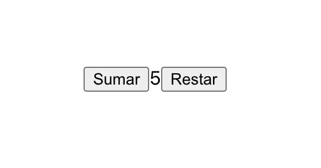

# Sumar y restar

### OBJETIVO
- Modificar el estado.
- Modificar estado del padre por medio de funciones mandadas como props.

## Consigna

1. Comenzar nuevo proyecto de React con el comando `npx create-react-app sumar-restar`.

2. Debemos de tener 2 botones, uno para sumar y otro para restar.

3. Cada que demos click al botón de sumar debe sumar el estado y cada que demos click al botón de restar debe restar el mismo estado

4. Resultado:

