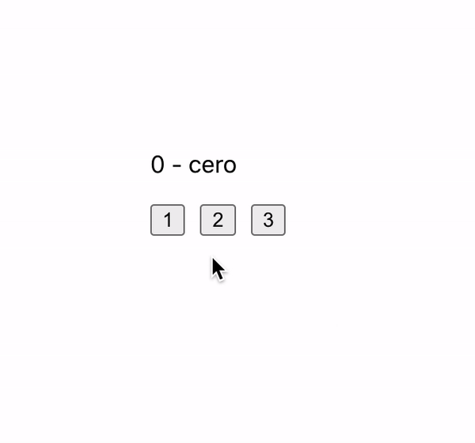

# React

## 3 botones

### OBJETIVO
- Aprender a manejar el estado con useState

#### Consigna

1. Comenzar nuevo proyecto de React con el comando `npx create-react-app 3-botones`.

2. Tendremos 2 estados `numero` y `texto`, el número sera definido por un botón y el texto debera de ser el número en palabra. El estado inicial debe de ser `0` - `Cero`.

3. Debemos de tener UNA sola función llamada `convertir` que modifique el estado para todos los botones.

4. Resultado:

