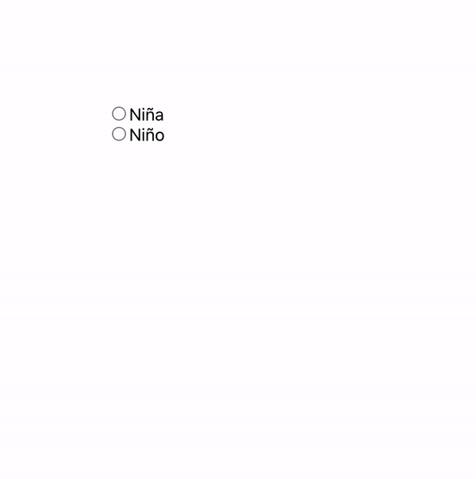

# ¿Niño o niña?

## OBJETIVO
- Practicar el renderizado condicional

## Consigna

1. Comenzar nuevo proyecto de React con el comando `npx create-react-app nino-nina`.

2. Usa radio buttons, onClick, CSS y renderizado condicional para mostrar el color rosa/azul y el sexo del bebe.

4. Trata de usar mínimo 2 componentes y que uno reciba props, para que practiques clases pasadas también.

5. Resultado

