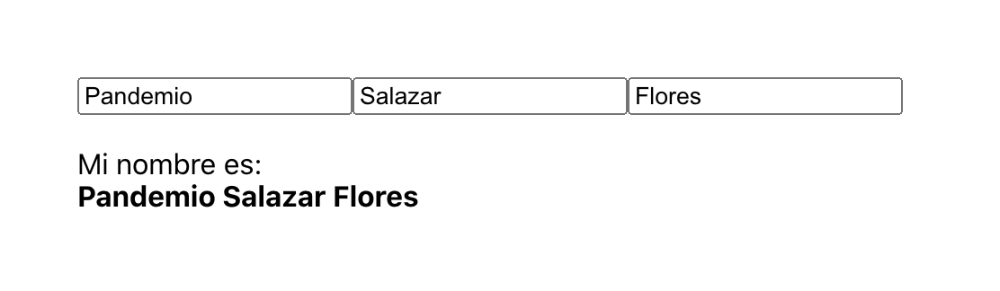

# ¿Cómo te llamas?

### OBJETIVO
- Usando useState para creación y modificación de estado (state).


## Consigna

1. Comenzar nuevo proyecto de React con el comando `npx create-react-app como-te-llamas`.

2. Vamos a darle un margen a la aplicación para que no se vea en la mera esquina, creamos una clase CSS y se la ponemos a nuestro `div` principal.
```
.margen {
   margin: 100px;
}
``` 

4. Pongámos 3 campos de texto en el cual podamos escribir nuestro nombre completo y desplegarlo.

5. El estado deberá de ser usado de la siguiente manera:
```
const [state, setState] = useState({
   nombre: '',
   apellidos: [
      '',   // Materno
      ''    // Paterno
   ]
});
``` 

6. Cambia los estados usando máximo 2 funciones para todos los atributos.

7. Recuerda que es MUUUUY importante hacer copias del estado si vas a cambiar cosas antes del `useState`, esto para seguir la regla de inmutabilidad.

8. Resultado:

