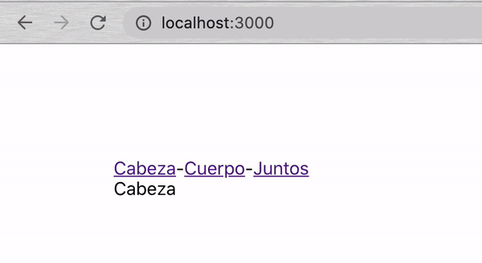

# Anatomía

### OBJETIVO
- react router dom.
- Componente anchor (a).
- Componente Link.
- Exact path.


## Consigna

1. Comenzar nuevo proyecto de React con el comando `npx create-react-app anatomia`.

2. Vamos a darle un margen a la aplicación para que no se vea en la mera esquina, creamos una clase CSS y se la ponemos a nuestro `div`.
```
.margen {
   margin: 100px;
}
``` 

3. Ahora vamos a instalar una librería. En la consola la instalamos con el comando `npm install react-router-dom` ó `yarn add react-router-dom` y cuando termine, la comenzamos con `npm start`.

4. Importamos los componentes que vamos a necesitar de la librería.
```
import { BrowserRouter, Route } from 'react-router-dom';
``` 

5. Como queremos que nuestra applicación completa tenga rutas, vamos a hacer que el enrutador `BrowserRouter` sea el padre de TODO.
```
import React from 'react';
import { BrowserRouter, Route } from 'react-router-dom';

const App = () => {
   return (
      <BrowserRouter>
         <div className="margen">
            Hola Mundo!
         </div>
      </BrowserRouter>
   );
};

export default App;
```

6. Listo, ya hicimos que nuestra aplicación acepte rutas dinámicas. Ahora vamos a probarlas.

7. Como el enrutador despliega componentes, vamos a crear 2 nuevos componentes  `Cabeza.js` y `Cuerpo.js`.
```
import React from 'react';

const Cabeza = () => {
   return (
      <div>
         Cabeza
      </div>
   );
};

export default Cabeza;
```
```
import React from 'react';

const Cuerpo = () => {
   return (
      <div>
         Cuerpo
      </div>
   );
};

export default Cuerpo;
```

8. Ahora le vamos a decir al enrutador que cada que nuestra aplicación este en el url `/` que despliegue el componente `Cabeza.js` y cuando este en `/cuerpo` que despliegue el `Cuerpo.js`.
```
import React from 'react';
import { BrowserRouter, Route } from 'react-router-dom';
import Cabeza from './Cabeza';
import Cuerpo from './Cuerpo';

const App = () => {
   return (
      <BrowserRouter>
         <div className="margen">
            Hola Mundo!
         </div>

         <Route path="/" component={Cabeza} />
         <Route path="/cuerpo" component={Cuerpo} />
      </BrowserRouter>
   );
};

export default App;
```

9. En este momento las rutas se estan haciendo de manera manual. Para poder ver el resultado hay que jugar con las rutas.
   - Cabeza: [http://localhost:3000/](http://localhost:3000/)
   - Cuerpo: [http://localhost:3000/cuerpo](http://localhost:3000/cuerpo)

10. Ahora vamos a agregar un menú o header en donde manejemos nuestras rutas con enlaces. Creamos el componente `Header.js` y agregamos enlaces a las 2 rutas que manejamos en este momento.
```
import React from 'react';

const Header = () => {
   return (
      <div>
         <a href="/">
            Cabeza
         </a>
         -
         <a href="/cuerpo">
            Cuerpo
         </a>
      </div>
   );
};

export default Header;
```

11. Importamos en `App.js`, metemos todo dentro del margen y probamos.
```
import React from 'react';
import { BrowserRouter, Route } from 'react-router-dom';
import Header from './Header';
import Cabeza from './Cabeza';
import Cuerpo from './Cuerpo';

const App = () => {
   return (
      <BrowserRouter>
         <div className="margen">
            <Header />

            <Route path="/" component={Cabeza} />
            <Route path="/cuerpo" component={Cuerpo} />
         </div>
      </BrowserRouter>
   );
};

export default App;
```

12. Ahora nuestro `Header.js` es el encargado de llevarnos de una ruta a otra; PEEEERO, si te fijas bien, cada vez que estamos viajando de una ruta a otra, la página se recarga. Y esto esta extremadamente mal. Cuando lleguemos al modulo de `redux` te vas a dar cuenta del porqué.

13. Esto esta pasando porque usamos el componente anchor `<a />`; pero como nuestro enrutador viene de `react-router-dom`, vamos a usar su componente de ruteo `Link`.

14. Para pasar de `a` a `Link` seguimos 3 pasos:
   - Importar de librería
   - Cambiar todos los `<a />` por `<Link />`
   - Cambiar `href` por `to`
```
import React from 'react';
import { Link } from 'react-router-dom';

const Header = () => {
   return (
      <div>
         <Link to="/">
            Cabeza
         </Link>
         -
         <Link to="/cuerpo">
            Cuerpo
         </Link>
      </div>
   );
};

export default Header;
```

15. Vuelve a probar la app; mira, siente y disfruta la fluidez y dinamismo de viajar entre rutas.

16. Pero ahora tenemos otro problema, el `Cuerpo.js` se enojó porque la `Cabeza.js` tiene su propia ruta y él no; y tiene razón.

17. Vamos a hacer que las rutas sean específicas agregando el atributo de `exact`.
```
<Route exact path="/" component={Cabeza} />
<Route exact path="/cuerpo" component={Cuerpo} />
```

18. Como lo dice el atributo, ahora el componente solo se desplegará cuando la ruta sea exactamente igual.

19. Pero resulta que `Cuerpo.js` ahora extraña a `Cabeza.js`, pero también quiere conservar su espacio personal. Y como somos seres perfectos y piadosos, les vamos a dar su ruta compartida.

20. Creamos un nuevo enlace en `Header.js`.
```
<Link to="/juntos">
   Juntos
</Link>
```

21. Y en `App.js` ahora vamos a desplegar 2 componentes en una misma ruta de una nueva manera.
```
<Route exact path="/" component={Cabeza} />
<Route exact path="/cuerpo" component={Cuerpo} />
<Route exact path="/juntos">
   <Cabeza />
   <Cuerpo />
</Route>
```

22. Ya cada uno tiene su lugar y también aprendieron a compartir.

23. Resultado:

