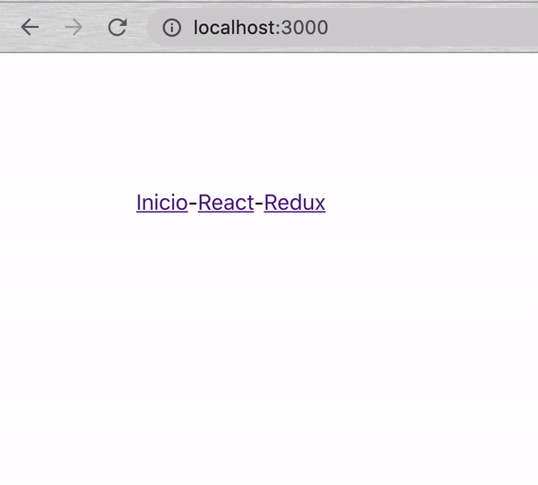

# Plan de estudios

## OBJETIVOS
- Exact path.
- Parámetros por url.

## Comisión

1. Comenzar nuevo proyecto de React con el comando `npx create-react-app plan-estudios`.

2. Vamos a darle un margen a la aplicación para que no se vea en la mera esquina, creamos una clase CSS y se la ponemos a nuestro `div`.
```
.margen {
   margin: 100px;
}
``` 

3. `npm install react-router-dom` y `npm start`.

4. Importamos la librería y hacemos a `BrowserRouter` el padre.
```
import React from 'react';
import { BrowserRouter, Route } from 'react-router-dom';

const App = () => {
   return (
      <BrowserRouter>
         <div className="margen">
            Hola Mundo!
         </div>
      </BrowserRouter>
   );
};

export default App;
``` 

5. Creamos nuestro `Header.js` con 3 enlaces por ahora.
```
import React from 'react';
import { Link } from 'react-router-dom';

const Header = () => {
   return (
      <div>
         <Link to="/">
            Inicio
         </Link>
         -
         <Link to="/react">
            React
         </Link>
         -
         <Link to="/redux">
            Redux
         </Link>
      </div>
   );
};

export default Header;
```

6. Importamos en `App.js` y lo usamos.
```
import React from 'react';
import { BrowserRouter, Route } from 'react-router-dom';
import Header from './Header';

const App = () => {
   return (
      <BrowserRouter>
         <div className="margen">
            <Header />
         </div>
      </BrowserRouter>
   );
};

export default App;
```

7. Creamos 2 nuevos componentes `PlanReact.js` y `PlanRedux.js`.
```
import React from 'react';

const PlanReact = () => {
   return (
      <div>
         React
      </div>
   );
};

export default PlanReact;
```
```
import React from 'react';

const PlanRedux = () => {
   return (
      <div>
         Redux
      </div>
   );
};

export default PlanRedux;
```

8. De manera específica, hacer que `/react` despliegue el componente `PlanReact.js` y `/redux` que despliegue el `PlanRedux.js`.
```
import React from 'react';
import { BrowserRouter, Route } from 'react-router-dom';
import Header from './Header';
import PlanReact from './PlanReact';
import PlanRedux from './PlanRedux';

const App = () => {
   return (
      <BrowserRouter>
         <div className="margen">
            <Header />

            <Route exact path="/react" component={PlanReact} />
            <Route exact path="/redux" component={PlanRedux} />
         </div>
      </BrowserRouter>
   );
};

export default App;
```

9. Ahora vamos a hacer que `PlanReact.js` también maneje sus propias rutas. Ponemos el título en un `<h1 />` y agregamos los `Link`s.
```
import React from 'react';
import { Link } from 'react-router-dom';

const PlanReact = () => {
   return (
      <div>
         <h1>React</h1>

         <Link to="/react/jsx">
            Jsx
         </Link>
         -
         <Link to="/react/hooks">
            Hooks
         </Link>
      </div>
   );
};

export default PlanReact;
```

10. Nuestro enrutamiento tiene 2 posibles problemas:
   - Los sublinks (Jsx y Hooks) no estan mostrando el tema (React).
   - Si el url principal (/react/...) cambia, habría que cambiar toooodas las rutas relacionadas.

11. Probablemente ya tengas una idea de como solucionar el primer problema. Como nuestra ruta es `exact` no esta permitiendo que se añada a rutas que lo contengan. Vamos a quitarle el exact y volvemos a probar.
```
<Route path="/react" component={PlanReact} />
```

12. Vamos a crear un nuevo componente `SubtemaViejo.js` con `<p />` en lugar de `<div />`.
```
import React from 'react';

const SubtemaViejo = () => {
   return (
      <p>
         SubtemaViejo
      </p>
   );
};

export default SubtemaViejo;
```

13. Hacemos que este componente se despliegue para `/react/jsx` de manera exacta.
```
<div className="margen">
   <Header />

   <Route path="/react" component={PlanReact} />
   <Route exact path="/react/jsx" component={SubtemaViejo} />

   <Route exact path="/redux" component={PlanRedux} />
</div>
```

14. Como react se trata de la reutilización, vamos a reutilizar nuestro `SubtemaViejo.js` para todos los subtemas que tengamos.

15. En `<Route />` vamos a especificar que el 2ndo parámetro de `/react/...` sea una variable. Una vez hecho, los 2 subtemas funcionarán.
```
<Route exact path="/react/:subtema" component={SubtemaViejo} />
```

16. Ahora vamos a desplegar el valor de la variable `subtema`. Lo vamos a hacer de la manera vieja (antes de los hooks).

17. En `SubtemaViejo.js` importamos `withRouter` y envolvemos el componente original (`SubtemaViejo` en este caso).
```
import React from 'react';
import { withRouter } from 'react-router';

const SubtemaViejo = () => {
   return (
      <p>
         SubtemaViejo
      </p>
   );
};

export default withRouter(SubtemaViejo);
```

18. `withRouter` es un ["Componente de orden superior"](https://es.reactjs.org/docs/higher-order-components.html) (HOC ó higher-order component). En pocas palabras, éste tipo de componentes reciben otro componente como parámetro y regresan el mismo componente mandado pero con propiedades (props) extra a las que tenía.

29. En nuestro caso, `withRouter` le esta dando ciertas `props` a `SubtemaViejo`.

20. Declaramos las `props` en el componente y las imprimimos para ver que traen.
```
import React from 'react';
import { withRouter } from 'react-router';

const SubtemaViejo = (props) => {
   console.log('props: ', props);
   return (
      <p>
         SubtemaViejo
      </p>
   );
};

export default withRouter(SubtemaViejo);
```

21. Las `props` vienen con 3 objetos: history, location y match. La que nosotros necesitamos es la de `match`.

22. [Destructuramos](https://developer.mozilla.org/en-US/docs/Web/JavaScript/Reference/Operators/Destructuring_assignment) nuestra variable `subtema`, la renderizamos y borramos el `console.log()`. Recuerda seguir las [buenas prácticas para propiedades (props)](../../BuenasPracticas/PropTypes/Readme.md).
```
import React from 'react';
import PropTypes from 'prop-types';
import { withRouter } from 'react-router';

const SubtemaViejo = (props) => {
   const {
      match: {
         params: { subtema }
      }
   } = props;

   return (
      <p>
         {subtema}
      </p>
   );
};

SubtemaViejo.propTypes = {
   match: PropTypes.shape({
      params: PropTypes.shape({
         subtema: PropTypes.string
      })
   })
};

export default withRouter(SubtemaViejo);
```

23. Pregunta que acaba de pasar y no continúes hasta que lo entiendas al 100%.

24. Qué pasaría si por alguna razón queremos cambiar todas nuestras rutas de `/react/...` por `/planreact/...`. Tendríamos que corregir las rutas en `App.js`, `Header.js` y `PlanReact.js`. No es tan complicado porque son pocos lugares donde hay que corregir, pero imagina que estamos dandole mantenimiento a una aplicación empresarial. La verdad que flojera.

25. Vamos a preparar nuestro sistema para tener que hacer el cambio una sola vez.

26. Creamos un nuevo folder `helpers` dentro de `src` y un archivo `constants.js` dentro de `helpers`. Al final termina así: `/src/helpers/constants.js`.


27. Declaramos y exportamos nuestras rutas dentro de `constants.js`.
```
export const RUTAS = {
   inicio: '/',
   planReact: '/react',
   planRedux: '/redux'
};
```

28. Importamos las rutas en `App.js` y las reemplazamos en todos los `<Route />`s.
```
import React from 'react';
import { BrowserRouter, Route } from 'react-router-dom';
import Header from './Header';
import PlanReact from './PlanReact';
import PlanRedux from './PlanRedux';
import SubtemaViejo from './SubtemaViejo';
import { RUTAS } from '../helpers/constants';

const App = () => {
   return (
      <BrowserRouter>
         <div className="margen">
            <Header />

            <Route path={RUTAS.planReact} component={PlanReact} />
            <Route exact path={`${RUTAS.planReact}/:subtema`} component={SubtemaViejo} />

            <Route exact path={RUTAS.planRedux} component={PlanRedux} />
         </div>
      </BrowserRouter>
   );
};

export default App;
```

29. Hacemos lo mismo en `Header.js`.
```
import React from 'react';
import { Link } from 'react-router-dom';
import { RUTAS } from '../helpers/constants';

const Header = () => {
   return (
      <div>
         <Link to={RUTAS.inicio}>
            Inicio
         </Link>
         -
         <Link to={RUTAS.planReact}>
            React
         </Link>
         -
         <Link to={RUTAS.planRedux}>
            Redux
         </Link>
      </div>
   );
};

export default Header;
```

30. Ahora vamos a `PlanReact.js` y de la manera vieja (antes de los hooks) vamos a obtener y usar el url que se este usando en ese momento.

31. Importamos `withRouter`, lo usamos, destructuramos lo que necesitamos y lo ponemos en el `<Link />`. Recuerda seguir las [buenas prácticas para propiedades (props)](../../BuenasPracticas/PropTypes/Readme.md)
```
import React from 'react';
import PropTypes from 'prop-types';
import { Link, withRouter } from 'react-router-dom';

const PlanReact = (props) => {
   const {
      match: { url }
   } = props;

   return (
      <div>
         <h1>React</h1>

         <Link to={`${url}/jsx`}>
            Jsx
         </Link>
         -
         <Link to={`${url}/hooks`}>
            Hooks
         </Link>
      </div>
   );
};

PlanReact.propTypes = {
   match: PropTypes.shape({
      url: PropTypes.string
   })
};

export default withRouter(PlanReact);
```

32. Listo, ahora ve a constants y cambia la ruta de `/react` a `/algo`. Dale click a todos los enlaces y mira como al cambiar una sola palabra el sistema completo se actualizó.

33. Ahora vamos a hacer lo mismo con `PlanRedux.js` pero de la manera con hooks. Importamos `useRouteMatch` y lo usamos.
```
import React from 'react';
import { Link, useRouteMatch } from 'react-router-dom';

const PlanRedux = () => {
   const match = useRouteMatch();

   return (
      <div>
         <h1>Redux</h1>

         <Link to={`${match.url}/actions`}>
            Actions
         </Link>
         -
         <Link to={`${match.url}/reducers`}>
            Reducers
         </Link>
      </div>
   );
};

export default PlanRedux;
```

34. Creamos nuevo componente `SubtemaHook.js`, importamos `useParams` y lo usamos.
```
import React from 'react';
import { useParams } from 'react-router-dom';

const SubtemaHook = () => {
   const { subtema } = useParams();

   return (
      <p>
         {subtema}
      </p>
   );
};

export default SubtemaHook;
```

35. Finalmente, importamos el componente en `App.js` y configuramos los `<Route />`s para que funcione.
```
import React from 'react';
import { BrowserRouter, Route } from 'react-router-dom';
import Header from './Header';
import PlanReact from './PlanReact';
import PlanRedux from './PlanRedux';
import SubtemaHook from './SubtemaHook';
import SubtemaViejo from './SubtemaViejo';
import { RUTAS } from '../helpers/constants';

const App = () => {
   return (
      <BrowserRouter>
         <div className="margen">
            <Header />

            <Route path={RUTAS.planReact} component={PlanReact} />
            <Route exact path={`${RUTAS.planReact}/:subtema`} component={SubtemaViejo} />

            <Route path={RUTAS.planRedux} component={PlanRedux} />
            <Route exact path={`${RUTAS.planRedux}/:subtema`} component={SubtemaHook} />
         </div>
      </BrowserRouter>
   );
};

export default App;
```

36. Aprendiste y aplicaste lo siguiente:
   - `exact path=""` vs `path=""`.
   - Buenas prácticas para manejar rutas (constants).
   - Mandar parámetros por url.
   - Obtener `url` y parámetros con HOC (higher-order component, withRouter).
   - Obtener `url` y parámetros con Hooks.

37. Resultado:

